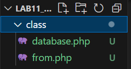
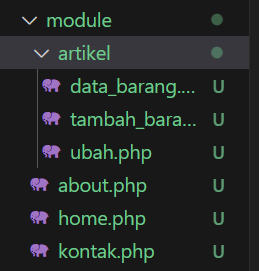
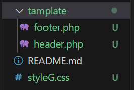

# Lab11Web
Tugas pemrograman WEB OOP Lanjutan #11
## Profil
| Variable | Isi |
| -------- | --- |
| **Nama** | Gilar Sumilar |
| **NIM** | 312210407 |
| **Kelas** | TI.22.A4 |
| **Mata Kuliah** | Pemrograman WEB |

# Instruksi Praktikum
- Copy file library (class) dari praktikum 10 dan letakkan pada folder class.
- Buat file template yang berisi template dan css untuk header, footer dan menu sidebar.
- Buat modul artikel yang berisi CRUD dengan memanfaatkan library database dan form tersbut.
- Lengkapi code programnya dan sesuaikan konfigurasi yang diperlukan.

# Langkah-langkah praktikum
## 

```php
    private function getConfig()
    {
        $this->host = "localhost";
        $this->user = "root";
        $this->password = "";
        $this->db_name = "latihan1";
    }
```
**Hasil :**



#### *Note :*
Pada function `getConfig()` berada di file database.php

## 

```php
```
**Hasil :**



#### *Note :*

## 

```php
```
**Hasil :**



#### *Note :*
